# 学生班级流转综合时序图

## 概述

本时序图对应"学生班级流转"活动图，涵盖以下完整流程：
1. 学生查看班级 → 选择班级 → 申请入班
2. 教师审核入班申请（批准/拒绝）
3. 入班成功后执行学习任务
4. 任务进度达到100%后可申请转班或退班
5. 教师审核转班/退班申请

---

## 综合时序图（PlantUML）

```plantuml
@startuml 学生班级流转综合时序图

skinparam sequenceArrowThickness 1.5
skinparam sequenceParticipantBorderColor #333333
skinparam sequenceLifeLineBorderColor #999999
skinparam sequenceDividerBackgroundColor #E8EAF6
skinparam noteBorderColor #666666
skinparam noteBackgroundColor #FFFDE7

title 学生班级流转综合时序图

actor 学生 as S
participant "学生前端页面\n(my-class / change-class)" as SUI
participant "申请服务\nEliaClassApplication" as AppSvc
participant "成员服务\nEliaClassMember" as MemSvc
participant "班级服务\nEliaClass" as ClsSvc
participant "用户服务\nSysUser" as UsrSvc
participant "数据库" as DB
participant "教师前端页面\n(my-classes)" as TUI
actor 教师 as T

== 第一阶段：查看班级与申请入班 ==

S -> SUI : 查看班级列表
SUI -> ClsSvc : 查询公开且未满的班级
ClsSvc -> DB : SELECT elia_class\nWHERE class_status='0'\nAND is_public='1'\nAND current_students < max_students
DB --> ClsSvc : 返回可选班级列表
ClsSvc --> SUI : 班级列表数据
SUI --> S : 展示可加入的班级

S -> SUI : 选择目标班级
S -> SUI : 填写申请理由，提交入班申请

SUI -> AppSvc : submitApplication\n(applicantId, classId, type='1', reason)
AppSvc -> DB : 校验是否有待审核申请\nSELECT FROM elia_class_application\nWHERE applicant_id=? AND class_id=?\nAND application_status='0'
DB --> AppSvc : 无重复申请

AppSvc -> DB : INSERT elia_class_application\n(application_type='1',\napplication_status='0')
DB --> AppSvc : 返回 application_id
AppSvc --> SUI : 申请提交成功
SUI --> S : 提示"申请已提交，等待老师审核"

== 第二阶段：教师审核入班申请 ==

T -> TUI : 查看待审核申请列表
TUI -> DB : SELECT elia_class_application\nWHERE class_id=? AND application_status='0'
DB --> TUI : 返回待审核申请列表
TUI --> T : 展示申请列表

alt 批准入班
  T -> TUI : 点击"批准入班"
  TUI -> AppSvc : approveApplication\n(applicationId, auditorId, remark)
  
  AppSvc -> DB : UPDATE elia_class_application\nSET application_status='1',\naudit_time=NOW(), audit_by=?
  
  AppSvc -> UsrSvc : isFirstJoinClass(userId)
  UsrSvc -> DB : 查询用户是否有历史班级记录
  DB --> UsrSvc : 返回 isFirstJoin
  UsrSvc --> AppSvc : isFirstJoin = true/false
  
  AppSvc -> MemSvc : joinClass(classId, userId, isFirstJoin)
  MemSvc -> DB : INSERT elia_class_member\n(member_status='0', is_first_join=?)
  DB --> MemSvc : 插入成功
  
  AppSvc -> ClsSvc : incrementStudentCount(classId)
  ClsSvc -> DB : UPDATE elia_class\nSET current_students = current_students + 1
  DB --> ClsSvc : 更新成功
  
  AppSvc -> UsrSvc : updateCurrentClass(userId, classId)
  UsrSvc -> DB : UPDATE sys_user\nSET current_class_id=?,\njoin_class_time=NOW()
  DB --> UsrSvc : 更新成功
  
  AppSvc --> TUI : 审核通过
  TUI --> T : 提示"已批准"
  
  note over S, SUI : 学生收到入班成功通知\n成功加入班级

else 拒绝入班
  T -> TUI : 点击"拒绝入班"，填写理由
  TUI -> AppSvc : rejectApplication\n(applicationId, auditorId, remark)
  AppSvc -> DB : UPDATE elia_class_application\nSET application_status='2',\naudit_remark=?
  DB --> AppSvc : 更新成功
  AppSvc --> TUI : 已拒绝
  TUI --> T : 提示"已拒绝"
  
  note over S, SUI : 学生收到入班失败通知\n流程结束
end

== 第三阶段：执行学习任务 ==

note over S, T : 入班成功后，学生开始执行班级学习任务

S -> SUI : 查看我的学习任务
SUI -> DB : 查询该班级分配的任务列表
DB --> SUI : 返回任务列表
SUI --> S : 展示待完成任务

loop 执行学习任务
  S -> SUI : 开始学习任务（单词学习等）
  SUI -> MemSvc : 记录学习进度\nupdateProgress(userId, classId, taskData)
  MemSvc -> DB : UPDATE elia_class_member\nSET completed_tasks += 1,\ntotal_study_time += ?,\nmastery_words += ?
  DB --> MemSvc : 更新成功
  MemSvc --> SUI : 进度已更新
  SUI --> S : 显示当前任务进度
end

== 第四阶段：判断任务完成率 ==

S -> SUI : 查看任务完成情况
SUI -> MemSvc : checkTaskCompletion\n(userId, classId)
MemSvc -> DB : SELECT completed_tasks\nFROM elia_class_member\nWHERE user_id=? AND class_id=?
DB --> MemSvc : 返回 completed_tasks
MemSvc -> DB : SELECT task_requirement\nFROM elia_class\nWHERE class_id=?
DB --> MemSvc : 返回 task_requirement
MemSvc --> SUI : 返回完成率\n(completed_tasks / task_requirement)

alt 任务进度未达100%
  SUI --> S : 提示"继续完成学习任务"
  note over S : 返回第三阶段继续学习
  
else 任务进度达到100%
  SUI --> S : 提示"任务已全部完成，可申请转班或退班"
  
  alt 学生选择申请转班
    
    == 第五阶段A：申请转班 ==
    
    S -> SUI : 进入换班中心
    SUI -> ClsSvc : listAvailableForTransfer\n(currentLevel)
    ClsSvc -> DB : 查询同级及高一级的可选班级\n(排除当前班级，排除已满班级)
    DB --> ClsSvc : 返回可选班级列表
    ClsSvc --> SUI : 可选班级数据
    SUI --> S : 展示可转入的班级
    
    S -> SUI : 选择目标班级，填写理由，提交
    SUI -> AppSvc : submitApplication\n(applicantId, toClassId, type='2', reason)\n设置 original_class_id = 当前班级ID
    AppSvc -> DB : INSERT elia_class_application\n(application_type='2',\noriginal_class_id=?,\napplication_status='0')
    DB --> AppSvc : 返回 application_id
    AppSvc --> SUI : 转班申请提交成功
    SUI --> S : 提示"转班申请已提交"
    
    == 目标班级教师审核转班 ==
    
    T -> TUI : 查看转班申请
    TUI -> DB : 查询待审核转班申请
    DB --> TUI : 返回转班申请列表
    
    alt 同意转班
      T -> TUI : 点击"同意"
      TUI -> AppSvc : approveApplication\n(applicationId, auditorId, remark)
      
      AppSvc -> DB : UPDATE elia_class_application\nSET application_status='1'
      
      group 事务：原班级退出
        AppSvc -> MemSvc : quitClass(fromClassId, userId)
        MemSvc -> DB : UPDATE elia_class_member\nSET member_status='2'\nWHERE class_id=原班级 AND user_id=?
        AppSvc -> ClsSvc : decrementStudentCount(fromClassId)
        ClsSvc -> DB : UPDATE elia_class\nSET current_students -= 1\n(原班级)
      end
      
      group 事务：新班级加入
        AppSvc -> MemSvc : joinClass(toClassId, userId, false)
        MemSvc -> DB : INSERT elia_class_member\n(member_status='0',\nis_first_join=false)\n(新班级，学习数据从零开始)
        AppSvc -> ClsSvc : incrementStudentCount(toClassId)
        ClsSvc -> DB : UPDATE elia_class\nSET current_students += 1\n(新班级)
      end
      
      AppSvc -> UsrSvc : updateCurrentClass(userId, toClassId)
      UsrSvc -> DB : UPDATE sys_user\nSET current_class_id=新班级ID,\njoin_class_time=NOW()
      
      AppSvc --> TUI : 转班成功
      TUI --> T : 提示"已同意转班"
      
      note over S, SUI : 转班成功\n学生进入新班级，学习数据重新开始
      
    else 不同意转班
      T -> TUI : 点击"拒绝"，填写理由
      TUI -> AppSvc : rejectApplication\n(applicationId, auditorId, remark)
      AppSvc -> DB : UPDATE elia_class_application\nSET application_status='2'
      AppSvc --> TUI : 已拒绝
      TUI --> T : 提示"已拒绝"
      
      note over S, SUI : 留在当前班级继续学习
    end
    
  else 学生选择申请退班
    
    == 第五阶段B：申请退班 ==
    
    S -> SUI : 点击"退出班级"
    SUI --> S : 弹出确认框
    S -> SUI : 填写退班理由，确认提交
    
    SUI -> AppSvc : submitApplication\n(applicantId, classId, type='3', reason)
    AppSvc -> DB : INSERT elia_class_application\n(application_type='3',\napplication_status='0')
    DB --> AppSvc : 返回 application_id
    AppSvc --> SUI : 退班申请提交成功
    SUI --> S : 提示"退班申请已提交"
    
    == 当前班级教师审核退班 ==
    
    T -> TUI : 查看退班申请
    TUI -> DB : 查询待审核退班申请
    DB --> TUI : 返回退班申请列表
    
    alt 同意退班
      T -> TUI : 点击"同意"
      TUI -> AppSvc : approveApplication\n(applicationId, auditorId, remark)
      
      AppSvc -> DB : UPDATE elia_class_application\nSET application_status='1'
      
      AppSvc -> MemSvc : quitClass(classId, userId)
      MemSvc -> DB : UPDATE elia_class_member\nSET member_status='2'
      
      AppSvc -> ClsSvc : decrementStudentCount(classId)
      ClsSvc -> DB : UPDATE elia_class\nSET current_students -= 1
      
      AppSvc -> UsrSvc : updateCurrentClass(userId, null)
      UsrSvc -> DB : UPDATE sys_user\nSET current_class_id = NULL
      
      AppSvc --> TUI : 退班成功
      TUI --> T : 提示"已同意退班"
      
      note over S, SUI : 退班成功\n学生当前不属于任何班级
      
    else 不同意退班
      T -> TUI : 点击"拒绝"，填写理由
      TUI -> AppSvc : rejectApplication\n(applicationId, auditorId, remark)
      AppSvc -> DB : UPDATE elia_class_application\nSET application_status='2'
      AppSvc --> TUI : 已拒绝
      TUI --> T : 提示"已拒绝"
      
      note over S, SUI : 留在当前班级继续学习
    end
    
  end
end

@enduml
```

---

## 时序图与活动图的对应关系

| 活动图节点 | 时序图阶段 | 说明 |
|-----------|-----------|------|
| 活动起点 → 查看班级 | 第一阶段 | 学生浏览公开班级列表 |
| 选择可加入班级 | 第一阶段 | 学生选择目标班级 |
| 申请入班 | 第一阶段 | 提交入班申请（type='1'） |
| 处理学生入班申请 | 第二阶段 | 教师查看并审核申请 |
| 是否同意学生入班？→ 是 → 批准入班 | 第二阶段 alt 批准入班 | 审核通过，执行入班操作 |
| 是否同意学生入班？→ 否 → 拒绝入班 | 第二阶段 alt 拒绝入班 | 审核拒绝，入班失败 |
| 入班失败 | 第二阶段 拒绝分支 | 流程终止 |
| 成功加入班级 | 第二阶段 批准分支结束 | 成员记录创建，班级人数+1 |
| 执行学习任务 | 第三阶段 | 学生完成班级学习任务 |
| 检查任务进度是否100% | 第四阶段 | 校验 completed_tasks / task_requirement |
| 否 → 继续学习 | 第四阶段 未达标分支 | 返回继续执行任务 |
| 是 → 申请转班 | 第五阶段A | 提交转班申请（type='2'） |
| 是 → 申请退班 | 第五阶段B | 提交退班申请（type='3'） |
| 同意退班 → 退班成功 | 第五阶段B 同意分支 | 成员状态改为已退出，current_class_id 置空 |
| 不同意 → 留在当前班级 | 第五阶段A/B 拒绝分支 | 学生留在原班级 |
| 同意 → 转班成功 | 第五阶段A 同意分支 | 原班级退出 + 新班级加入（事务） |
| 活动终点 | 各分支结束 | 流程结束 |

---

## 关键业务规则说明

1. 入班前置条件：目标班级必须为公开状态（is_public='1'）、正常状态（class_status='0'）且未满员（current_students < max_students）。
2. 转班前置条件：学生在当前班级的任务完成率必须达到100%（completed_tasks >= task_requirement）。
3. 转班等级规则：学生可转入同级、低级或高一级的班级（如当前D级可转到D级或C级）。
4. 转班数据处理：转班后学生在新班级的学习数据从零开始，原班级的学习数据保留在历史成员记录中。
5. 退班后状态：退班成功后 sys_user.current_class_id 置为 NULL，学生不属于任何班级。
6. 事务一致性：转班操作涉及原班级退出和新班级加入，必须在同一事务中完成，保证数据原子性。
